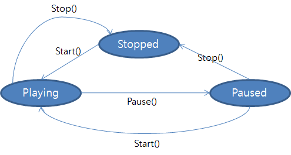
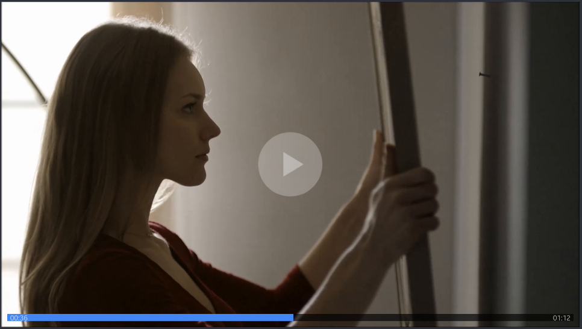

# MediaPlayer
## Introduction
MediaPlayer provides functionality of playing multimedia. It also includes related view components that display video stream.

## How to use
#### C#
``` c#
var page = new OverlayPage();
var player = new MediaPlayer();
player.VideoOutput = page;
player.Source = "a.mp4";
player.Start();
```
#### XAML
``` xml
<tvcontrols:OverlayPage xmlns="http://xamarin.com/schemas/2014/forms"
             xmlns:x="http://schemas.microsoft.com/winfx/2009/xaml"
             xmlns:tvcontrols="clr-namespace:Tizen.TV.UIControls.Forms;assembly=Tizen.TV.UIControls.Forms"
             xmlns:local="Sample.TestOverlayPage"
             x:Class="Sample.TestOverlayPage">
    <tvcontrols:OverlayPage.Player>
        <tvcontrols:MediaPlayer Source="{Binding Source}" AutoPlay="true" UsesEmbeddingControls="False"/>
    </tvcontrols:OverlayPage.Player>
</tvcontrols:OverlayPage>
```

## PlaybackState
 MediaPlayer has a PlaybackState. Some APIs only work on the certain state and some APIs transit the state.
#### State diagram of PlaybackState



## Video output type
#### Overlay
 * It displays video data on the overlay plane. It is more efficient and fast but has a limit shape. Usually it is used to display the video as fullscreen.
 * OverlayPage
 * OverlayMediaView

[comment]: <> (#### Buffer)
[comment]: <> (* It displays video data on the graphics buffer using GL surface. It is free to change the shape, but if it does not support GL surface, you can't use it.)
[comment]: <> ( It is usually used to attach a video on a part of the view.)
[comment]: <> (* MediaView)


## Associating Player with media view
 MediaPlayer and video output are created independently. The developer needs to associate Player and the video output to display video data.

#### Use Player property of OverlayMediaView
``` xml
 <tvcontrols:OverlayMediaView>
     <tvcontrols:OverlayMediaView.Player>
         <tvcontrols:MediaPlayer Source="{Binding Source}"/>
     </tvcontrols:OverlayMediaView.Player>
 </tvcontrols:OverlayMediaView>
```
``` c#
 var overlayMediaView = new OverlayMediaView();
 overlayMediaView.Player = new MediaPlayer();
```

#### Use VideoOutput property of Player
``` c#
 var player = new MediaPlayer();
 player.VideoOutput = new OverlayPage();
```


## Embedding controls
 By default, MediaPlayer provides an embedding control. If you don't want to use the default embedding controls, set `UsesEmbeddingControls` to false.
``` c#
public bool UsesEmbeddingControls
```



## AutoPlay/AutoStop
Video can't play before media view is shown, so you need to know when the media views are available. If you use AutoPlay/AutoStop property, you don't need to care about the view state.
#### AutoPlay
``` c#
public bool AutoPlay
```
 Automatically starts a player when a View is shown (Rendered).
#### AutoStop
``` c#
public bool AutoStop
```
Automatically stops a player when a View is gone (Renderer was disposed).

## Related Links
 * [Sample](https://github.com/Samsung/Tizen.TV.UIControls/tree/master/sample/Sample/MediaPlayer)